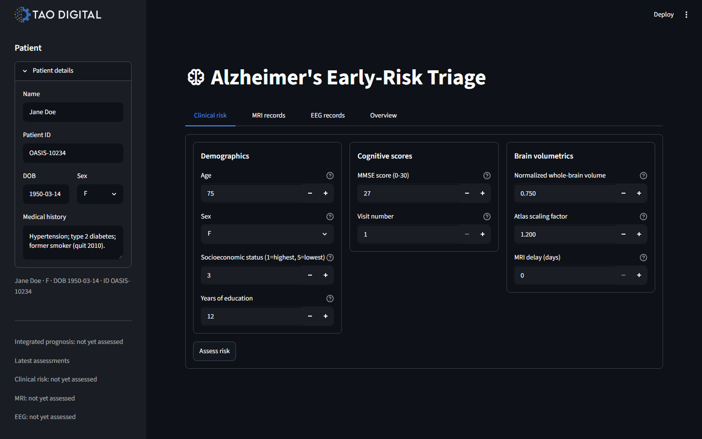
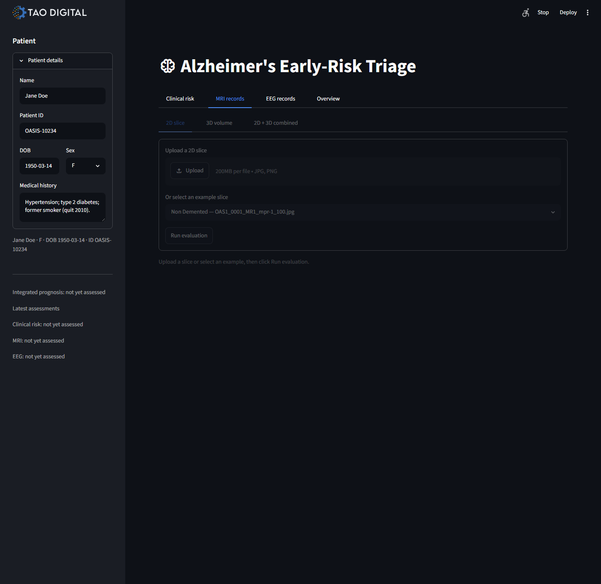
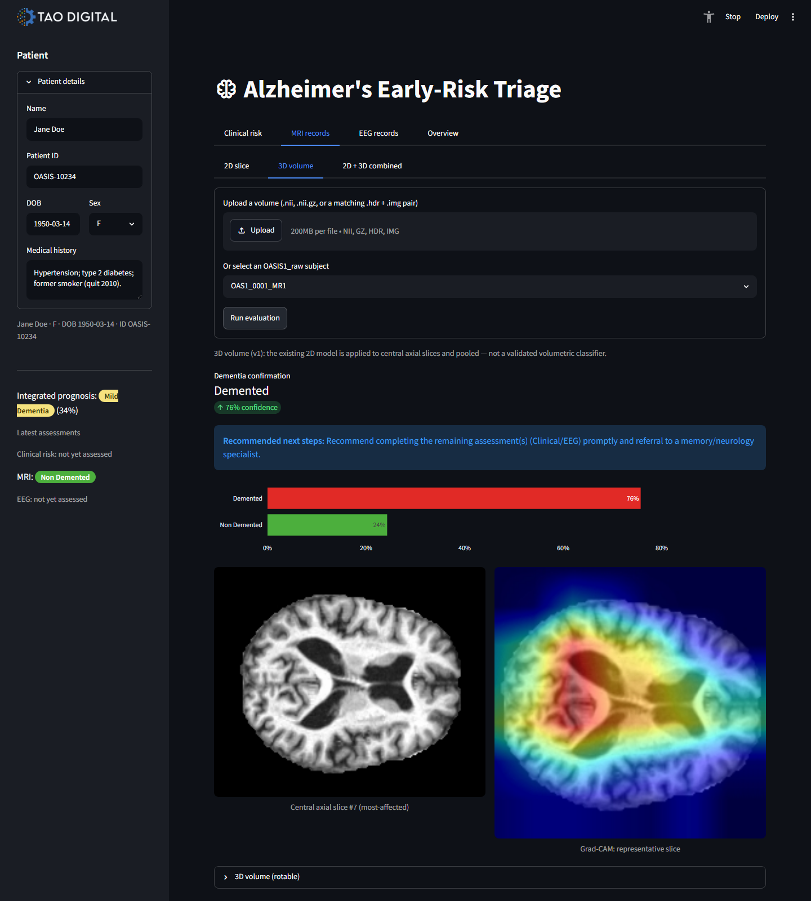
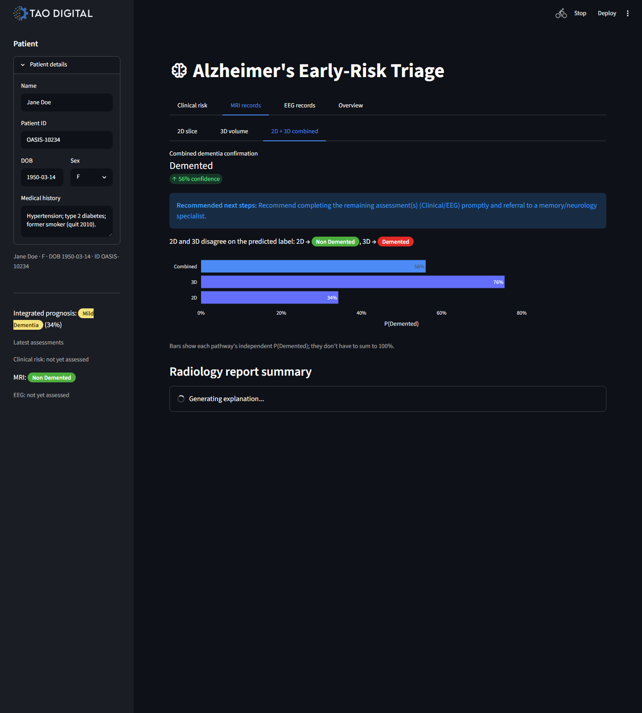
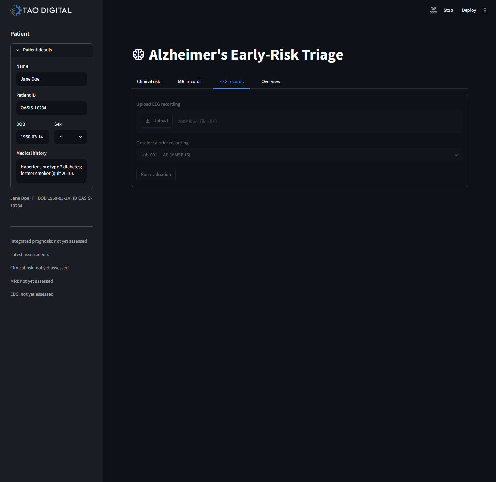

# Alzheimer's Early-Risk Triage

Proof of capability for Siemens Digital Health / SHS AI: a multi-modal Alzheimer's-risk pipeline
that fuses structured clinical data, MRI (2D + 3D), and EEG into one integrated risk score, each
paired with an LLM-generated narrative explanation — all behind one integration seam any system
can call.

## Use cases

1. **Early-risk triage from routine clinical data** *(built)* — cognitive scores + demographics →
   risk score + top contributing factors, before imaging is ordered.
   See [src/alz/model.py](src/alz/model.py), [src/alz/explain.py](src/alz/explain.py).

   

2. **MRI-based confirmation** *(built)* — 2D slice, 3D volume, and combined 2D+3D pathways, each
   a 4-class severity classification (Non Demented / Very mild / Mild / Moderate Dementia) via a
   transfer-learned ResNet18, with Grad-CAM attention maps and a rotatable 3D volume render.
   See [src/alz/imaging.py](src/alz/imaging.py).

   
   
   

3. **EEG-based analysis** *(built)* — band-power features (delta/theta/alpha/beta/gamma,
   slowing ratio) extracted from raw recordings, classified against a healthy/AD reference
   cohort, with a scalp topography map of slow-wave power.
   See [src/alz/eeg.py](src/alz/eeg.py).

   

4. **Multi-modal fusion** *(built)* — the SHS differentiator: clinical, MRI, and EEG risk scores
   are combined into one integrated prognosis via a logarithmic opinion pool (weighted average in
   log-odds space). See [src/alz/fusion.py](src/alz/fusion.py) and
   [docs/fusion-methodology.md](docs/fusion-methodology.md).

5. **LLM-based explainability** *(built)* — radiology-style report summaries (vision-LLM when a
   scan image is available), plain-language EEG readouts, a cross-modality clinical conclusions
   note, live PubMed/ClinicalTrials.gov evidence retrieval, and a case-grounded chat interface.
   See [src/alz/explain.py](src/alz/explain.py).

All five are wired together in the Streamlit demo ([app/streamlit_app.py](app/streamlit_app.py)),
organized as **Clinical risk / MRI records / EEG records / Overview** tabs around one patient
context.

## Run it

```bash
uv venv
uv pip install -r requirements.txt
uv run python train.py                          # trains models/model.joblib on data/oasis_longitudinal.csv
uv run pytest tests/test_smoke.py               # train -> predict roundtrip check
uv run streamlit run app/streamlit_app.py       # interactive demo

# MRI (2D + 3D), optional:
uv pip install -r requirements-imaging.txt
uv run python train_mri.py                      # trains models/mri_model.pt on data/imagesoasis
uv run python evaluate_mri.py                   # evaluation report -> results/, eval_plots/

# EEG, optional:
uv pip install -r requirements-eeg.txt
uv run python train_eeg.py                      # trains the EEG classifier on data/ds004504
```

The LLM-based explainability features (radiology summaries, EEG readouts, evidence retrieval,
case chat) call [llm.py](llm.py) (Groq) and need a `GROQ_API_KEY` in a `.env` file
(`python-dotenv`). Without a key, these panels degrade gracefully and are simply skipped.

## Integration seam

Any system (UI, API, notebook) calls the same function for the clinical pathway:

```python
from alz import predict
predict({"Age": 75, "EDUC": 12, "SES": 3, "MMSE": 27, "nWBV": 0.75, "ASF": 1.2,
          "Visit": 1, "MR Delay": 0, "M/F": "F"})
# -> {"score": 0.12, "label": "Normal", "drivers": [...]}
```

MRI, EEG, and fusion are reachable the same way for programmatic use — see
[src/alz/imaging.py](src/alz/imaging.py), [src/alz/eeg.py](src/alz/eeg.py), and
[src/alz/fusion.py](src/alz/fusion.py).

Wrapping this in a FastAPI service is a small, deliberately deferred next step
(see [app/api.py](app/api.py) for the current stub).

## Repo structure

```text
src/alz/           # data cleaning, clinical model, imaging (2D/3D + Grad-CAM), EEG, fusion, LLM explainability
app/                # Streamlit demo (app/streamlit_app.py) + API stub (app/api.py)
llm.py              # shared LLM client (Groq), used by src/alz/explain.py
train.py            # CLI: train + save the clinical model
train_mri.py        # CLI: train the MRI classifier
train_eeg.py         # CLI: train the EEG classifier
evaluate_mri.py      # CLI: MRI evaluation report
tests/               # smoke + explainability tests
data/                # sample/reference datasets (clinical, imagesoasis, OASIS1_raw, ds004504 EEG)
docs/                # methodology, demo notes, presentation, screenshots
models/              # saved model artifacts (model.joblib, mri_model.pt, ...)
results/, eval_plots/  # evaluation outputs
vendor/              # reference repos we build on (git submodule)
requirements.txt, requirements-imaging.txt, requirements-eeg.txt  # base / MRI / EEG dependency sets
```

## What this builds on

- [HimanS-sys/alzheimers-disease-prediction](https://github.com/HimanS-sys/alzheimers-disease-prediction)
  (vendored under `vendor/`) — its OASIS-2 preprocessing is the basis for `src/alz/data.py`, and
  its 3D-CNN notebook is the reference template for the MRI imaging pipeline. One deliberate
  deviation: we drop `CDR` as a predictor, since CDR is itself the clinical diagnosis and using it
  to predict risk would leak the answer into a tool meant to screen patients *before* diagnosis.
- [GMattheisen/predicting_Alzheimers_from_MRI](https://github.com/GMattheisen/predicting_Alzheimers_from_MRI) —
  feature-selection / accuracy reference.
- [invcble/Alzheimer-s-Classification-using-OASIS-Dataset](https://github.com/invcble/Alzheimer-s-Classification-using-OASIS-Dataset) —
  reference for CDR-based severity bucketing.
- torchvision (ImageNet-pretrained ResNet18) — the MRI classifier's backbone
  (`requirements-imaging.txt`); used as an installed library, not reimplemented. The vendor
  notebook's 3D MONAI/TorchIO/MedicalNet pipeline targets volumetric NIfTI scans; the 3D pathway
  here instead applies the 2D model to pooled central axial slices from a NIfTI/OASIS1_raw volume
  (documented as a v1 approach, not a validated volumetric classifier, in the app itself).
- HuggingFace `google/gemma-3-27b-it` (vision) and Groq-hosted LLMs — used as installed/hosted
  models for the narrative explainability layer (`src/alz/explain.py`), not vendored code.

These reference repos ship no license, so we adapt their approach in our own code rather than
copying files verbatim, and credit them here. Only a synthetic OASIS-shaped sample is committed;
real OASIS/ds004504 data has its own data-use terms (see [data/README.md](data/README.md)).

## Deliberately skipped for this MVP

- Auth, Docker, model registry, CI.
- A validated volumetric (true 3D) MRI classifier — the current 3D pathway is a documented v1
  approximation (2D model applied to pooled central slices).
